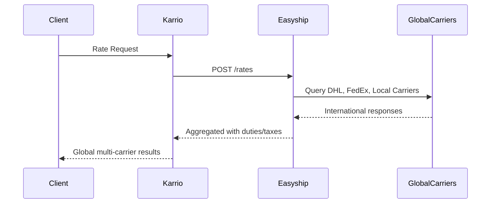

# Easyship Integration PRD

## Overview

Easyship is a **hub carrier** integration - a multi-carrier shipping aggregator providing access to hundreds of carriers worldwide through their unified API. Unlike direct carrier integrations, Easyship specializes in international shipping and cross-border commerce solutions.

## Architecture

### Hub vs Direct Carrier Pattern

```
Direct Carrier: Karrio → UPS API → UPS Network
Hub Carrier:    Karrio → Easyship API → {DHL, FedEx, UPS, Local Carriers, +200 intl carriers}
```

### Key Architectural Differences

1. **Plugin Metadata**: `is_hub=True` flag
2. **Dynamic Services**: Services discovered from API responses, not static enums
3. **Multi-Carrier Results**: Single request returns rates from multiple carriers
4. **International Focus**: Strong cross-border and duty/tax calculations

## Implementation Structure

```
community/plugins/easyship/
├── karrio/
│   ├── plugins/easyship/       # Plugin registration (is_hub=True)
│   ├── mappers/easyship/       # Integration layer
│   ├── providers/easyship/     # Business logic
│   └── schemas/easyship/       # Generated data types
├── schemas/                    # API schema files (JSON)
├── tests/                      # Unit tests
└── generate                    # Schema generation script
```

## Connection & Authentication

**API Key Authentication**:
- Single API key for all operations
- Production-only endpoint (no separate test environment)
- Base URL: `https://api.easyship.com/2023-01`

## Core Features

### 1. Multi-Carrier Rating
- **Endpoint**: `POST /rates`
- **Pattern**: International focus with duty/tax calculations
- **Service Discovery**: Dynamic service enumeration from global carriers

### 2. Shipment Creation
- **Endpoint**: `POST /shipments`
- **Pattern**: Cross-border shipment creation
- **International**: Built-in customs and documentation

### 3. Tracking
- **Endpoint**: `GET /tracking`
- **Pattern**: Global tracking across international carriers

## Data Flow



## Hub-Specific Implementation Patterns

### Dynamic Service Discovery
- Services discovered from API responses rather than predefined
- Service codes generated dynamically: `easyship_{courier_name}_{service_name}`
- International carrier focus with regional specialization

### Multi-Carrier Rate Parsing with International Features
- Single API response contains rates from multiple global carriers
- Each rate includes duty/tax calculations and delivery time estimates
- Currency handling for international transactions
- Metadata preserves courier and service information

## Schema Generation Configuration

**Standard JSON API Pattern**:
```bash
# Use default parameters for mixed case fields
kcli codegen generate "$1" "$2" --no-nice-property-names
```

## International Features

### Cross-Border Capabilities
- **Duty & Tax Calculations**: Automatic customs calculation
- **Document Generation**: Commercial invoices, customs forms
- **Prohibited Items**: Automated compliance checking
- **Local Delivery**: Last-mile delivery in destination countries

### Regional Carrier Access
- **Asia-Pacific**: Local carriers in Singapore, Hong Kong, Australia
- **Europe**: Regional European carriers and postal services
- **Americas**: Local carriers in Canada, Mexico, South America

## Testing Patterns

Hub carriers require specific test patterns:
- **International Addresses**: Test cross-border address validation
- **Currency Handling**: Verify multi-currency rate responses
- **Duties/Taxes**: Test customs calculation inclusion

## Integration Checklist

- [ ] Plugin metadata with `is_hub=True`
- [ ] Dynamic service discovery implementation
- [ ] Multi-carrier response parsing
- [ ] International address handling
- [ ] Duty/tax calculation support
- [ ] Cross-border compliance features

## Key Differences from Other Carriers

| Aspect | Direct Carrier | ShipEngine | Easyship |
|--------|----------------|------------|----------|
| **Location** | `modules/connectors/` | `community/plugins/` | `community/plugins/` |
| **Metadata** | `is_hub=False` | `is_hub=True` | `is_hub=True` |
| **Focus** | Single carrier | US-centric | International |
| **Services** | Static enum | Dynamic US carriers | Dynamic global carriers |
| **Features** | Basic shipping | Multi-carrier US | Cross-border commerce |
