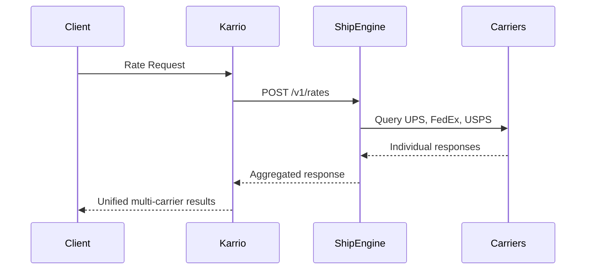

# ShipEngine Integration PRD

## Overview

ShipEngine is a **hub carrier** integration - a multi-carrier shipping platform that aggregates major carriers (UPS, FedEx, USPS, DHL, etc.) through a unified REST API. Unlike direct carrier integrations, ShipEngine manages multiple carrier relationships and provides optimized shipping solutions.

## Architecture

### Hub vs Direct Carrier Pattern

```
Direct Carrier: Karrio → UPS API → UPS Network
Hub Carrier:    Karrio → ShipEngine API → {UPS, FedEx, USPS, DHL, +30 carriers}
```

### Key Architectural Differences

1. **Plugin Metadata**: `is_hub=True` flag
2. **Dynamic Services**: Services discovered from API responses, not static enums
3. **Multi-Carrier Results**: Single request returns rates from multiple carriers
4. **Snake Case Fields**: Uses snake_case (unlike camelCase in UPS/FedEx)

## Implementation Structure

```
community/plugins/shipengine/
├── karrio/
│   ├── plugins/shipengine/     # Plugin registration (is_hub=True)
│   ├── mappers/shipengine/     # Integration layer
│   ├── providers/shipengine/   # Business logic
│   └── schemas/shipengine/     # Generated data types
├── schemas/                    # API schema files (JSON)
├── tests/                      # Unit tests
└── generate                    # Schema generation script
```

## Connection & Authentication

**Simple API Key Authentication**:
- Single API key for all operations
- Same endpoint for test/production (controlled by API key configuration)
- Base URL: `https://api.shipengine.com/v1`

## Core Features

### 1. Multi-Carrier Rating
- **Endpoint**: `POST /v1/rates`
- **Pattern**: Single request → multiple carrier responses
- **Service Discovery**: Dynamic service enumeration from API responses

### 2. Shipment Creation
- **Endpoint**: `POST /v1/labels`
- **Pattern**: Carrier-specific shipment creation
- **Label Generation**: PDF/PNG label formats

### 3. Tracking
- **Endpoint**: `GET /v1/tracking`
- **Pattern**: Unified tracking across all carriers

### 4. Address Validation
- **Endpoint**: `POST /v1/addresses/validate`
- **Pattern**: Built-in address validation capabilities

## Data Flow



## Hub-Specific Implementation Patterns

### Dynamic Service Discovery
- Services are discovered from API responses rather than predefined
- Service codes generated dynamically: `shipengine_{carrier_code}_{service_code}`
- Metadata includes actual carrier information

### Multi-Carrier Rate Parsing
- Single API response contains rates from multiple carriers
- Each rate includes carrier identification and service metadata
- Unified format with carrier-specific details preserved

## Schema Generation Configuration

**Snake Case API Pattern**:
```bash
# Use --nice-property-names for snake_case conversion
kcli codegen generate "$1" "$2" --nice-property-names
```

## Testing Patterns

Hub carriers require specific test patterns:
- **Service Discovery**: Test dynamic service enumeration
- **Multi-Carrier Results**: Verify multiple rates in single response
- **Carrier Identification**: Test proper carrier attribution in metadata

## Integration Checklist

- [ ] Plugin metadata with `is_hub=True`
- [ ] Dynamic service discovery implementation
- [ ] Multi-carrier response parsing
- [ ] Snake case schema generation
- [ ] Unified tracking across carriers
- [ ] Address validation integration

## Key Differences from Direct Carriers

| Aspect | Direct Carrier | Hub Carrier |
|--------|----------------|-------------|
| **Location** | `modules/connectors/` | `community/plugins/` |
| **Metadata** | `is_hub=False` | `is_hub=True` |
| **Services** | Static enum | Dynamic discovery |
| **Results** | Single carrier | Multiple carriers |
| **Field Format** | Often camelCase | snake_case |
